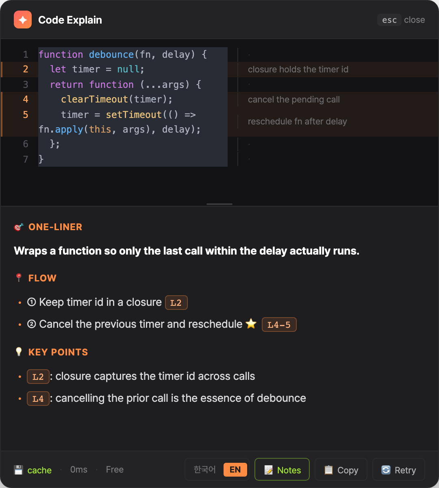

[English](README.md) · 한국어

# ✦ Codepop

> 어디서든 코드를 드래그하고 `⌘⇧E` 를 누르면 바로 설명해주는 macOS 데스크탑 앱. (한국어·영어 지원)

브라우저, VS Code, 터미널, Slack, PDF — 텍스트를 선택할 수 있는 곳이면 어디서나 동작합니다.



## 동작

1. 어떤 앱이든 코드를 드래그 선택
2. `⌘⇧E`
3. 커서 옆에 팝업 → 요약 + 핵심 + 의심점 + 라인별 설명
4. `ESC` 로 닫기

## 설치

1. [**Releases**](https://github.com/oxm55522/codepop/releases/latest) 에서 **`Codepop_x.x.x_aarch64.dmg`** 다운로드 → 더블클릭 → `Codepop.app` 을 **응용 프로그램** 폴더로 드래그
2. 첫 실행:
   - Launchpad/응용 프로그램에서 **Codepop** 더블클릭
   - "확인되지 않은 개발자 / 손상되어 열 수 없음" 경고가 뜨면:
     - **시스템 설정 → 개인정보 보호 및 보안** → 아래로 스크롤 → **"그래도 열기"** 클릭
     - 또는 터미널에서: `xattr -dr com.apple.quarantine /Applications/Codepop.app`
   - (이는 Apple 공증 미적용 때문입니다. 정식 서명 버전에선 사라집니다.)
3. 메뉴바에 **✦ 아이콘**이 생깁니다.

> Apple Silicon(M1~) 전용 빌드입니다.

## 처음 설정

앱을 처음 켜면 **설정 창**이 자동으로 열립니다.

1. **Gemini API 키 발급 (무료)** — [Google AI Studio](https://aistudio.google.com/apikey) → *Create API key*
   - Gemini 2.5 Flash Lite 무료 티어: 분당 15회 / 일 1500회 → 개인용 충분, **비용 0원**
2. 설정 창에 키 붙여넣기 → **저장**
3. 코드를 선택하고 `⌘⇧E` → **첫 회 "손쉬운 사용" 권한 요청** → 허용
   - 안 뜨면: **시스템 설정 → 개인정보 보호 및 보안 → 손쉬운 사용** 에서 Codepop 켜기
   - (다른 앱에서 선택한 코드를 읽기 위해 필요합니다. 키 입력을 가로채지 않습니다.)

## 설정 (메뉴바 ✦ → 설정)

| 항목 | 설명 |
|------|------|
| API 키 | Gemini 키 |
| 모델 | `2.5 Flash Lite`(기본) / `2.5 Flash` / `2.5 Pro` |
| 단축키 | 예 `cmd+shift+e` — 수식어(cmd/shift/alt/ctrl)+키(a~z,0~9) |
| 언어 | 한국어 / English (팝업 푸터에서 즉시 토글도 가능) |

> 시스템 언어가 한국어면 한국어로, 아니면 영어로 자동 시작합니다.

## 기능

- **라인별 설명** — 팝업의 📝 주석 버튼으로 코드 옆에 한 줄 설명
- **라인 참조 점프** — 설명의 `L23` 클릭 시 해당 코드 줄로 스크롤·강조
- **SHA256 캐싱** — 같은 코드 재선택 시 API 호출 없이 즉시
- **한↔영 토글** — 푸터 버튼으로 즉시 전환 (저장됨)
- **창 이동** — 팝업 상단 바를 드래그
- **재분석** — 🔄 버튼 (캐시 무시)

## 비용 / 개인정보

- 무료 모델 → **API 비용 0원**
- API 키는 `~/.codepop/config.json` 에 로컬 저장 (`chmod 600`)
- 캐시는 `~/.codepop/cache/` 에 로컬만, 외부 전송 없음
- 선택한 코드는 분석 시에만 Gemini 로 전송 (응답은 캐시되어 재선택 시 호출 안 함)
- 민감 코드 캐시 정리: `rm -rf ~/.codepop/cache/*`

## 제거

응용 프로그램에서 Codepop 삭제 + (원하면) `rm -rf ~/.codepop`

## 빌드 (개발자)

```bash
npm install
npm run tauri dev      # 개발 실행
npm run tauri build    # .app + .dmg 생성 (src-tauri/target/release/bundle/)
```

마이그레이션 경위와 기술 구조는 [`MIGRATION_TAURI.md`](MIGRATION_TAURI.md) 참고.

## 라이센스

MIT — `LICENSE` 참고.
